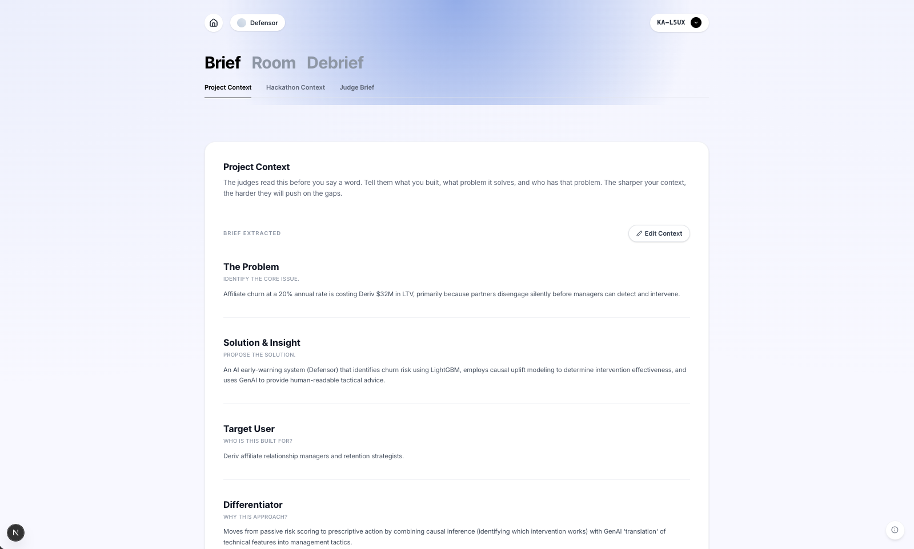
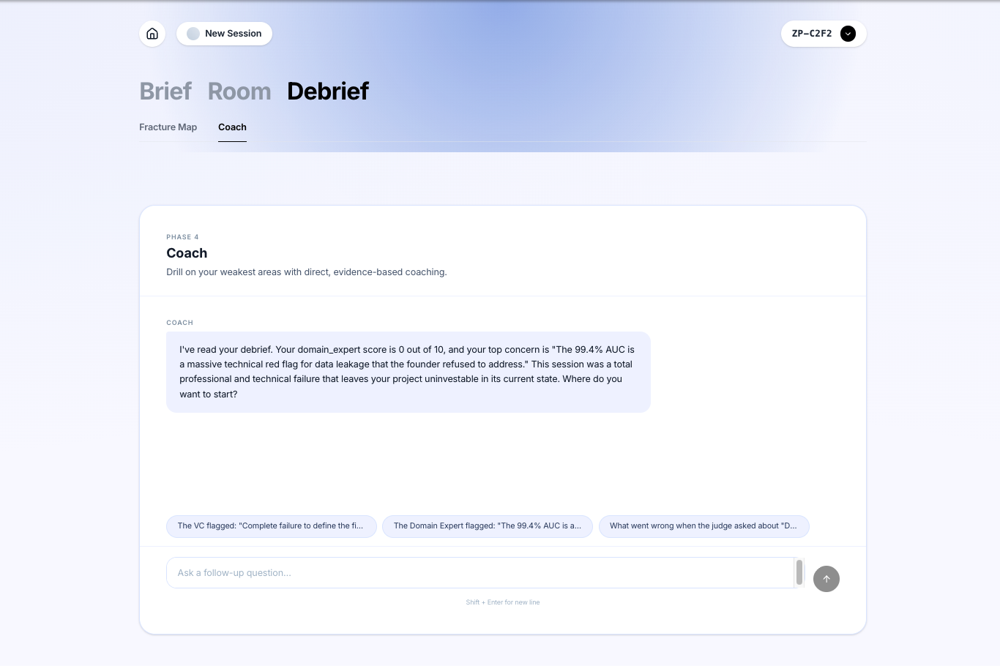
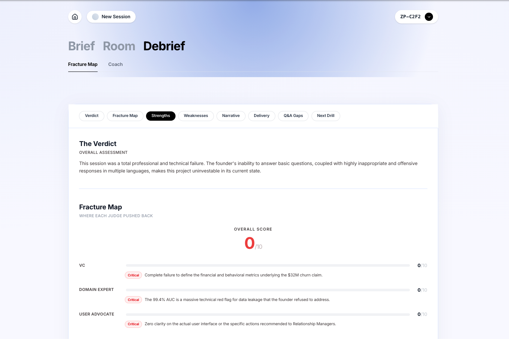

# Debrief

> Every founder practices the pitch. Nobody practices surviving the questions.

---

Three judges. Eight minutes. One verdict.

---

## The Problem Nobody Talks About

You've rehearsed your deck until the slides are muscle memory.  
You know your TAM. You know your unit economics.  
You've practiced the opening line forty times in the mirror.

But you've never faced Alex.

Alex is a VC Partner at Andreessen Horowitz.  
She's heard 400 pitches this year.  
She doesn't care about your deck.  
She wants to know why your go-to-market assumption is wrong —  
and she'll find the gap in under two minutes.

Most founders discover this in the meeting that matters.

**Debrief exists so you don't.**

---

## How It Works

The session runs in three phases.

---

### The Brief

Before the judges say a word, they read your world.

You paste your project context. Upload your pitch deck.  
Debrief extracts the core: your problem, your solution, your target user —  
and loads it directly into each judge's memory.

They won't ask you to explain what you built.  
They'll ask you to defend it.



---

### The Room

You recorded your pitch. Now comes the part nobody prepared you for.


**Alex** (VC Partner, Andreessen · Series A) will probe your go-to-market.  
**Dr. Morgan** (Domain Expert, Technical Advisor) will find the gap in your architecture.  
**Sam** (User Advocate, UX Research Lead) will ask if real users actually have this problem.

They speak. You answer. Live audio, real pressure.  
The room knows when you're rambling.



---

### The Debrief

When it's over, you get the thing no pitch coach has ever given you:  
a fracture map.

Not "good job on the energy."  
A verdict from each judge. A score. The exact moment each one stopped believing you —  
and why.



Now you know what to fix before it counts.

---

## Under the Hood

Debrief runs two AI models simultaneously, each doing what it does best.

---

### The AI Architecture

```
┌──────────────────────────────────────────────────────────┐
│                     DEBRIEF SESSION                      │
│                                                          │
│  Brief  → [ Gemini Flash ]     → extracted_summary       │
│             (extraction)                                 │
│                  ↓                                       │
│  Pitch  → [ GCP STT Chirp 3 ]  → transcript              │
│             (transcription)                              │
│                  ↓                                       │
│  Q&A    → [ Gemini Live ]  ← PCM audio (AudioWorklet)   │
│             (3 judge personas, Vertex AI WebSocket)      │
│                  ↓                                       │
│  Debrief → [ Claude Opus ]    → fracture map + verdict  │
│              (ADK TypeScript, AG-UI streaming)           │
│                  ↓                                       │
│  Coach  → [ Claude Opus ]     → multi-turn coaching     │
│              (ADK TypeScript, CopilotKit)                │
└──────────────────────────────────────────────────────────┘
```

**Why two models?**  
Gemini Live is the only model that runs a persistent, low-latency audio WebSocket in the browser.  
Claude Opus produces the most precise structured reasoning for the fracture map.  
They never compete — Gemini runs live, Claude runs after.

---

### The Hard Problems

**Real-time audio in the browser**  
The microphone outputs at the device's native sample rate (44.1kHz or 48kHz).  
Gemini Live requires PCM 16-bit at 16kHz.  
An AudioWorklet resamples every frame in the browser — the server never touches audio bytes.

**Three judge personas, one WebSocket**  
All three judges run inside a single Gemini Live session.  
Speaker attribution is enforced via system prompt tag prefixes (`[VC]`, `[DOMAIN_EXPERT]`, `[USER_ADVOCATE]`).  
Every turn is written to Supabase incrementally — never batched, never lost.

**Persistent agent state across Cloud Run instances**  
Cloud Run scales horizontally. In-memory agent state disappears.  
ADK's `DatabaseSessionService` backs all agent sessions to Supabase —  
the debrief and coach agents survive across any container instance.

---

### Stack

| Layer | Technology | Why |
|---|---|---|
| Framework | Next.js 14 App Router | Full-stack, one repo, API routes co-located with UI |
| Q&A Judges | Gemini Live (Vertex AI) | Only model with persistent audio WebSocket |
| Debrief + Coach | Claude Opus via ADK TypeScript | Structured reasoning, multi-turn ReAct |
| Brief Extraction | Gemini Flash (Vertex AI) | Fast, single-call, stateless |
| Transcription | GCP STT Chirp 3 | Async via Cloud Tasks after pitch upload |
| Agent Persistence | ADK DatabaseSessionService → Supabase | Cloud Run horizontal scaling requires external state |
| Streaming | AG-UI Protocol + CopilotKit | Debrief streams structured events, not raw text |
| Infrastructure | GCP Cloud Run | min-instances=1, 600s timeout, cpu-boost for cold starts |

---

## Get Started

```bash
git clone https://github.com/abdullahabtahi/debrief
cd debrief
cp .env.example .env.local   # add your GCP + Supabase credentials
npm install
npm run dev
```

Open [http://localhost:3000](http://localhost:3000).

**Required credentials:**
- `SUPABASE_URL` + `SUPABASE_SERVICE_ROLE_KEY`
- `GOOGLE_CLOUD_PROJECT` + `VERTEX_AI_API_KEY`
- `GCS_BUCKET_NAME`

> Desktop only (1024px minimum). Use headphones during Q&A — the judges will hear themselves otherwise.

---

## One More Thing

The fracture map shows you where you broke.

But knowing *where* isn't the same as knowing *how to fix it.*

After every session, the Coach is waiting.

It's read the full debrief. It knows which judge pushed back hardest and why.  
It knows your delivery score, your filler word rate, the exact moment Dr. Morgan went quiet.

Ask it anything. Run the drill again. Come back tomorrow and pick up where you left off.

The session ends. The coaching doesn't.

---

*Built for the Anthropic Claude Hackathon 2025.*
